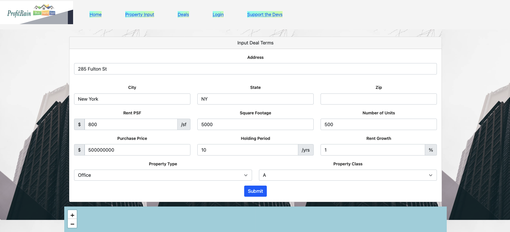
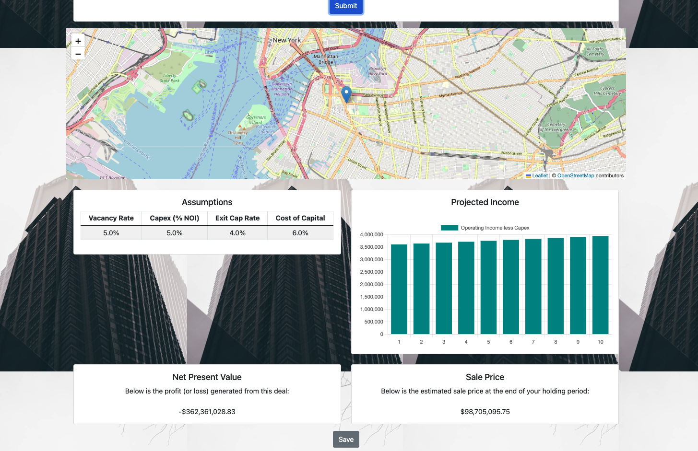
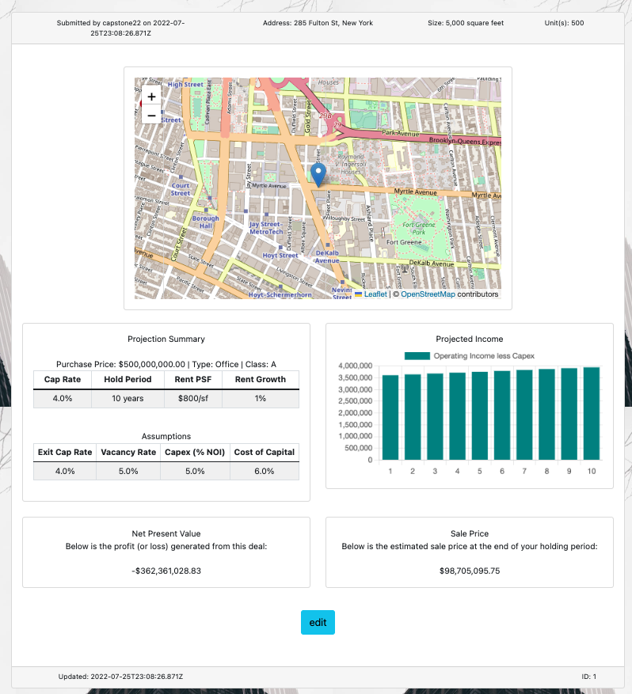
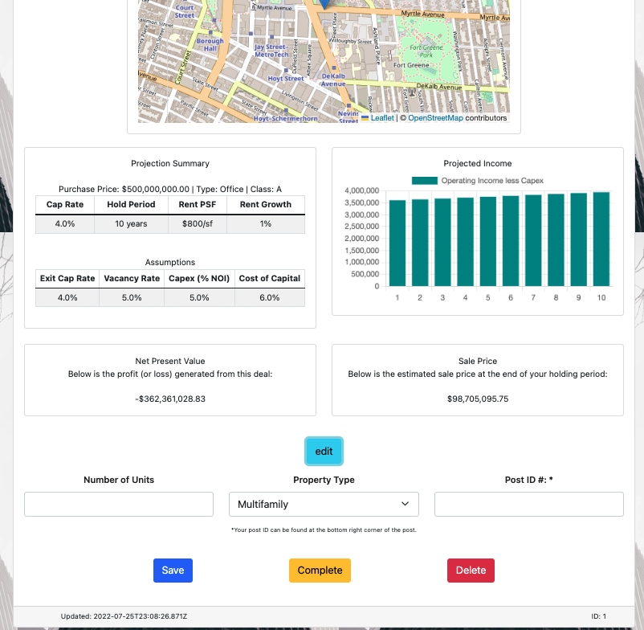

# Capstone2022-App

# Capstone2022-App

<h2>Welcome to our Profit Rain app!</h2>

This app was created for people who invest (or hope to invest) in real estate but may not necessarily know the calcalutions that one needs to succeed in real estate. If you already know those numbers, you can compare your assumptions with ours!

In our app, an investor can put in basic property information, such as, address, price, size, units, rent/sf, property class, & property class.

Once the submit button is pressed our app with give you the calculations for the cash flow, net present value & sale price for the property. You can also see the location in the map and the assumtions we made for the financials for the building

If you are satistfied with the  calculations, you can click save to save the deal to the datadase. After saving your calculations, you will be alerted & redirected to the Deals page.

We are woking on the update & delete for the properties but it is not ready to be rolled out yet

