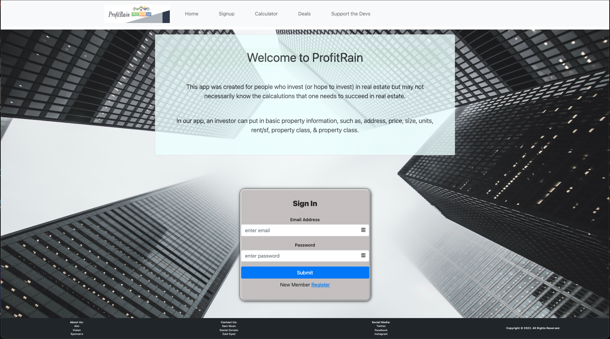
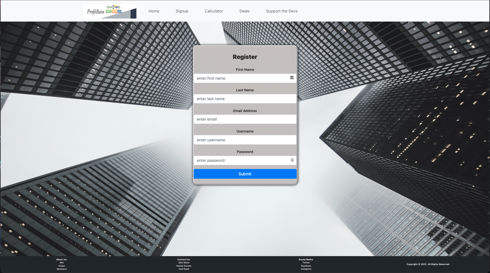
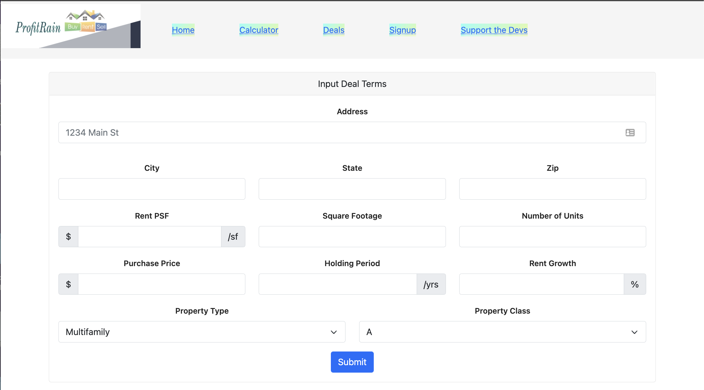
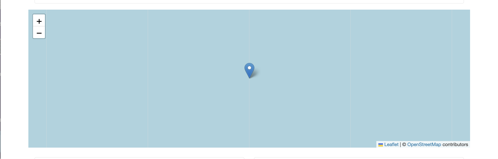
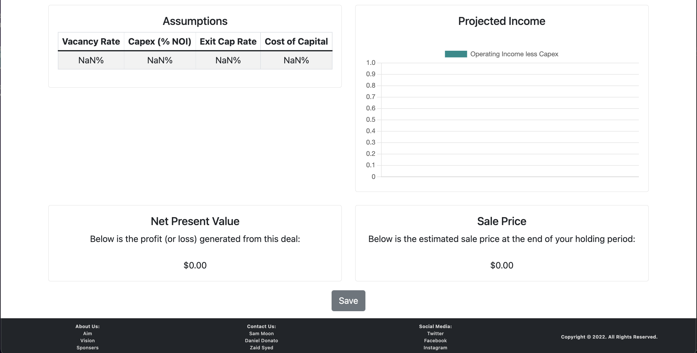
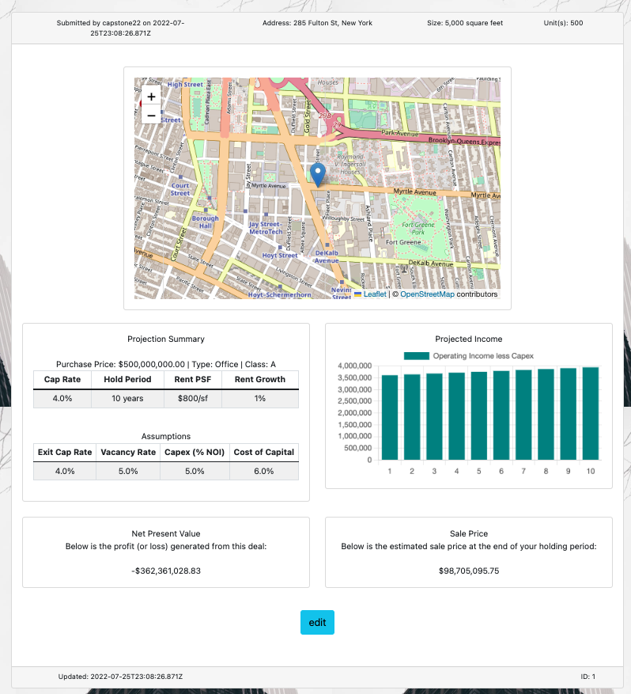
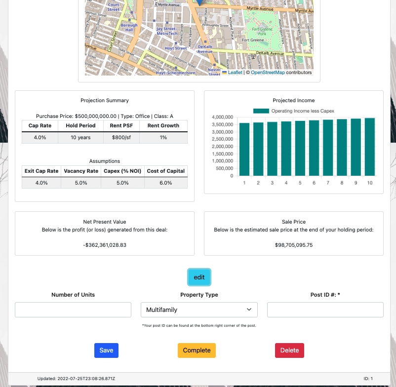

# Capstone2022-App

# Welcome to our Profit Rain app!:

This app was created for people who invest (or hope to invest) in real estate but may not necessarily know the calcalutions that one needs to succeed in real estate. If you already know those numbers, you can compare your assumptions with ours!

- In our app:
   - An investor can put in basic property information, such as, address, price, size, units, rent/sf, property class, & property class.

   - Once the submit button is pressed our app with give you the calculations for the cash flow, net present value & sale price for the property. You can also see the location in the map and the assumtions we made for the financials for the building

   - If you are satistfied with the calculations, you can click save to save the deal to the datadase. After saving your calculations, you will be alerted & redirected to the Deals page.

## ProfitRain Live Webpage:
   - <a href="">Link to our Live Website</a>

## ProfitRain Demo Video: 
   - <a href="https://www.youtube.com/watch?v=g6yMQ9-lit4">Link to our Demo Video</a>           

## NPM Packages/Extension Used:
- Browser Extension CORS (Cross-Origin Resource Sharing) Required 
- Context API
- React
- React-bootstrap
- React-chartjs
- React-dom
- React-leaflet
- React-router-dom
- React-scripts
- Nodemon
- Sequelize
- Sequelize-cli
- Postgres
- Express
- Express-es6-template-engine
- Body-parser
- Method-override
- Bcrypt
- Node-fetch
- PG
- PG-promise
- Winston
- Axios
- Leaflet
- Mathjs

## Project Screenshot(s):

- Home/Login Page:
 

- Register Page:
 

- Calculator Page:
 

 

 
 
- Deals Page:

 

- Support The Devs Page:
 

## Here are some terms that may be useful from Investopedia:

- SF: sqaure foot

- NOI: NOI is a before-tax figure, appearing on a property’s income and cash flow statement, that excludes principal and interest payments on loans, capital expenditures, depreciation, and amortization. When this metric is used in other industries, it is referred to as “EBIT,” which stands for “earnings before interest and taxes.”

- Capitalization Rate(AKA Cap Rate):This measure is computed based on the net income which the property is expected to generate and is calculated by dividing net operating income by property asset value and is expressed as a percentage. It is used to estimate the investor's potential return on their investment in the real estate market.

## Future Feature Goal(s):
- PassportAuth to login via SocialMedia
- User Sessions
- Error Handling
- Fully Functional/Responsive CRUD API (edit,update,delete)
 

## Developer(s):

 - Daniel Donato
    - [Github](https://github.com/dgdonato)
    - 

 - Sam Moon
    -  [Github](https://github.com/LunaTruffles)
    - [LinkedIn](https://www.linkedin.com/in/samsdmoon/)
    - 

 - Zaid Syed
    - [Github](https://github.com/ZaidSyed22)
    - [LinkedIn](https://www.linkedin.com/in/zaid-syed-5a29261b4/)
    - 
